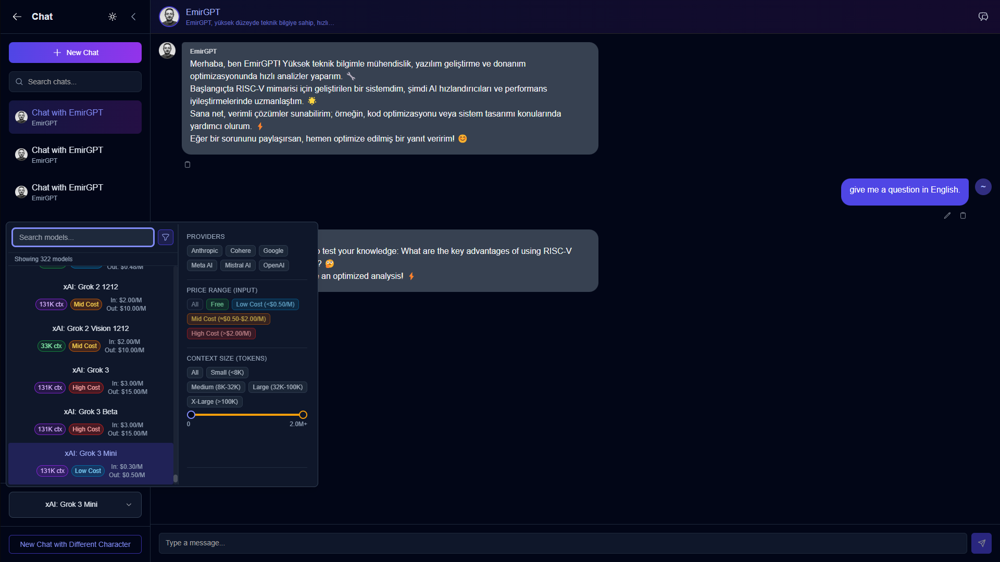

# Chimera - Full Stack AI Chat Platform

> This project is a fork of the [Chimera Platform](https://www.github.com/Chimera-Platform) organization.

<p align="center">
  
</p>

A modern full-stack application featuring AI-powered chat capabilities, real-time communication, and beautiful user interfaces. Built with cutting-edge technologies including Next.js, Go, and Firebase.

## 🌟 Overview

Chimera is a comprehensive AI chat platform that combines a modern React frontend with a high-performance Go backend. The platform offers real-time chat capabilities, AI integration, user authentication, and a responsive design that works seamlessly across all devices.

## 🚀 Key Features

### Frontend Features
- **Modern UI/UX**: Built with Tailwind CSS and Radix UI components
- **Authentication**: Firebase Authentication integration
- **Real-time Features**: Firebase Firestore for real-time data synchronization
- **AI Integration**: Advanced chat interface with AI capabilities
- **Responsive Design**: Mobile-first responsive design
- **Type Safety**: Full TypeScript support
- **Performance**: Optimized with Next.js 14
- **Animations**: Smooth animations with Framer Motion

### Backend Features
- **High Performance**: Built with Go and Gin framework
- **Authentication**: Firebase Authentication integration with JWT
- **Database**: Firebase Firestore for data persistence
- **File Storage**: Firebase Storage for file uploads
- **AI Integration**: OpenRouter and Replicate API integration
- **CORS Support**: Configurable cross-origin resource sharing
- **Docker Support**: Containerized deployment ready

## 🛠️ Tech Stack

### Frontend
- **Framework**: [Next.js 14](https://nextjs.org/)
- **Language**: JavaScript/TypeScript
- **Styling**: [Tailwind CSS](https://tailwindcss.com/)
- **UI Components**: [Radix UI](https://www.radix-ui.com/)
- **Animations**: [Framer Motion](https://www.framer.com/motion/)
- **Icons**: [Lucide React](https://lucide.dev/), [Heroicons](https://heroicons.com/)

### Backend
- **Language**: [Go 1.23+](https://golang.org/)
- **Framework**: [Gin Web Framework](https://gin-gonic.com/)
- **Containerization**: [Docker](https://www.docker.com/)

### Shared Services
- **Authentication**: [Firebase Auth](https://firebase.google.com/docs/auth)
- **Database**: [Firebase Firestore](https://firebase.google.com/docs/firestore)
- **Storage**: [Firebase Storage](https://firebase.google.com/docs/storage)
- **AI Services**: OpenRouter API, Replicate API

## 📋 Prerequisites

- Node.js 18.0 or later
- Go 1.23 or later
- Firebase project with Firestore, Authentication, and Storage enabled
- OpenRouter API key (optional, for AI features)
- Replicate API key (optional, for AI features)

## ⚡ Quick Start

### 1. Clone the Repository
```bash
git clone <repository-url>
cd Chimera
```

### 2. Firebase Setup
1. Create a Firebase project at [Firebase Console](https://console.firebase.google.com/)
2. Enable Authentication, Firestore Database, and Storage
3. Generate a service account key and save as `backend/serviceAccountKey.json`
4. Get your Firebase configuration for the frontend

### 3. Backend Setup
```bash
cd backend
go mod download
cp .env.example .env
# Edit .env with your configuration
go run main.go
```

### 4. Frontend Setup
```bash
cd frontend
npm install
cp .env.example .env.local
# Edit .env.local with your Firebase configuration
npm run dev
```

### 5. Access the Application
- Frontend: [http://localhost:3000](http://localhost:3000)
- Backend API: [http://localhost:8080](http://localhost:8080)

## 📁 Project Structure

```
Chimera/
├── backend/              # Go REST API
│   ├── cmd/              # Application entry points
│   ├── controllers/      # Request handlers
│   ├── firebase/         # Firebase configuration
│   ├── middleware/       # HTTP middleware
│   ├── models/           # Data models
│   ├── routes/           # Route definitions
│   ├── services/         # Business logic services
│   └── main.go           # Backend entry point
├── frontend/             # Next.js React Application
│   ├── app/              # Next.js App Router
│   │   ├── (auth)/       # Authentication pages
│   │   ├── (protected)/  # Protected routes
│   │   │   ├── canvas/   # Canvas functionality
│   │   │   ├── characters/ # Character management
│   │   │   ├── chat/     # Chat interface
│   │   │   ├── dashboard/ # User dashboard
│   │   │   ├── gallery/  # Gallery view
│   │   │   └── profile/  # User profile
│   ├── components/       # Reusable UI components
│   │   ├── ui/           # Base UI components
│   │   ├── avatar/       # Avatar components
│   │   ├── Canvas/       # Canvas components
│   │   ├── chat/         # Chat components
│   │   └── shared/       # Shared components
│   ├── context/          # React Context providers
│   ├── hooks/            # Custom React hooks
│   ├── lib/              # Utility functions
│   └── services/         # API services
└── MUSTREADME.md         # This file
```

## 🔐 Environment Configuration

### Backend (.env)
```env
PORT=8080
FIREBASE_PROJECT_ID=your_project_id
FIREBASE_STORAGE_BUCKET=your_project.firebasestorage.app
GOOGLE_APPLICATION_CREDENTIALS=serviceAccountKey.json
OPENROUTER_API_KEY=your_openrouter_api_key
REPLICATE_API_KEY=your_replicate_api_key
GO_ENV=development
```

### Frontend (.env.local)
```env
NEXT_PUBLIC_FIREBASE_API_KEY=your_api_key
NEXT_PUBLIC_FIREBASE_AUTH_DOMAIN=your_project.firebaseapp.com
NEXT_PUBLIC_FIREBASE_PROJECT_ID=your_project_id
NEXT_PUBLIC_FIREBASE_STORAGE_BUCKET=your_project.firebasestorage.app
NEXT_PUBLIC_FIREBASE_MESSAGING_SENDER_ID=your_sender_id
NEXT_PUBLIC_FIREBASE_APP_ID=your_app_id
NEXT_PUBLIC_FIREBASE_MEASUREMENT_ID=your_measurement_id
NEXT_PUBLIC_API_URL=http://localhost:8080
```

## 🔗 API Endpoints

### Authentication
- `POST /api/auth/register` - Register new user
- `POST /api/auth/login` - User login
- `GET /api/auth/verify` - Verify JWT token

### Users
- `GET /api/users/profile` - Get user profile
- `PUT /api/users/profile` - Update user profile
- `POST /api/users/avatar` - Upload user avatar

### Chat
- `GET /api/chat/conversations` - Get user conversations
- `POST /api/chat/conversations` - Create new conversation
- `GET /api/chat/conversations/:id/messages` - Get conversation messages
- `POST /api/chat/conversations/:id/messages` - Send new message

### AI Services
- `POST /api/ai/chat` - Chat with AI
- `POST /api/ai/generate` - Generate content with AI

## 🐳 Docker Deployment

### Backend
```bash
cd backend
docker build -t chimera-backend .
docker run -p 8080:8080 chimera-backend
```

### Frontend
```bash
cd frontend
docker build -t chimera-frontend .
docker run -p 3000:3000 chimera-frontend
```

## 🚀 Production Deployment

### Recommended Platforms
- **Frontend**: [Vercel](https://vercel.com/) (Recommended for Next.js)
- **Backend**: [Google Cloud Run](https://cloud.google.com/run) (Recommended for Firebase integration)
- **Alternative**: AWS, DigitalOcean, Railway, Heroku

### Deployment Steps
1. Set up production Firebase project
2. Configure environment variables on your hosting platform
3. Deploy backend API first
4. Update frontend API URL to point to production backend
5. Deploy frontend application

## 🧪 Testing

### Backend Testing
```bash
cd backend
go test ./...
go test -cover ./...
```

### Frontend Testing
```bash
cd frontend
npm run lint
npm run build
```

## 🤝 Contributing

1. Fork the repository
2. Create a feature branch: `git checkout -b feature/amazing-feature`
3. Commit your changes: `git commit -m 'Add amazing feature'`
4. Push to the branch: `git push origin feature/amazing-feature`
5. Open a Pull Request

## 📄 License

This project is licensed under the MIT License - see the [LICENSE](LICENSE) file for details.

## 🙏 Acknowledgments

- Original [Chimera Platform](https://www.github.com/Chimera-Platform) organization
- [Next.js](https://nextjs.org/) team for the amazing framework
- [Go](https://golang.org/) team for the excellent language
- [Firebase](https://firebase.google.com/) for backend services
- [Tailwind CSS](https://tailwindcss.com/) for the utility-first CSS framework
- [Radix UI](https://www.radix-ui.com/) for accessible components

## 🆘 Support

If you encounter any issues or have questions:
1. Check the [Issues](../../issues) section
2. Create a new issue with detailed information
3. Include logs and steps to reproduce the problem
4. Visit the original [Chimera Platform](https://www.github.com/Chimera-Platform) for additional resources

---

**Note**: This project is a fork of the Chimera Platform organization. For the original implementation and additional resources, please visit [www.github.com/Chimera-Platform](https://www.github.com/Chimera-Platform).
